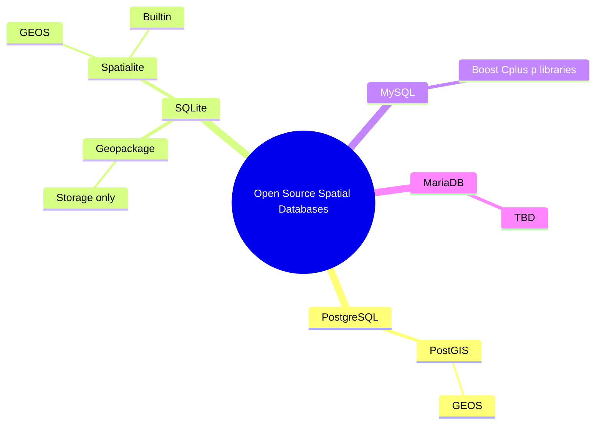

{: .box-success}
This post started out my exploration of building linear events for trail maintenance in PostGIS. And then I fed it AI (claude 3.5 Sonnet through VS Code)... which then proceeded to write about 80% of what you are about to read. Now I need to read and test everything it wrote to make sure this isn't some fat hallucination. 


In this comprehensive guide, we'll implement a complete trail maintenance management system using PostGIS linear referencing. This solution goes beyond basic spatial data management to create a full-featured system that includes:

**Core Functionality:**
- Create and manage event points along linear features
- Convert GPS observations into linear segments
- Build a flexible system for recording trail conditions
- Use PostgreSQL views for automatic updates

**Advanced Features:**
- Email notifications for maintenance crews
- REST API for mobile field data collection
- Automated quality control and validation
- Cost analysis and resource planning
- Priority-based work order generation
- Performance optimization for large datasets

**Integration Capabilities:**
- Mobile field collection apps
- Automated maintenance workflows
- Management reporting systems
- GIS visualization tools

**Implementation Considerations:**
1. **Database Setup**
   - PostgreSQL 12+ with PostGIS 3.0+
   - pgmail extension for email notifications
   - Proper user permissions and security settings

2. **Data Requirements**
   - Properly connected trail network
   - Consistent coordinate system (UTM recommended)
   - GPS accuracy estimates for field observations
   - Required attributes for maintenance records

3. **System Integration**
   - REST API endpoints for mobile apps
   - Email server configuration
   - Authentication and authorization
   - Regular backup procedures

4. **Performance Considerations**
   - Spatial indexing for large datasets
   - Materialized views for complex queries
   - Table partitioning strategies
   - Query optimization techniques

This implementation is particularly suitable for:
- Land management organizations
- Trail maintenance crews
- Parks and recreation departments
- Conservation organizations
- Facilities management teams

## Table of Contents
1. [Introduction](#1-introduction)
   - What is Linear Referencing?
   - Use Case and Process
2. [Methods and Implementation](#2-methods-and-implementation)
   - 2.1 [Input Data Setup](#21-input-data-setup)
   - 2.2 [Event Table Creation and Processing](#22-event-table-creation-and-processing)
     - 2.2.1 [Create Initial Events Table](#221-create-initial-events-table)
     - 2.2.2 [Create Events Layer with Point Objects](#222-create-events-layer-with-point-objects)
     - 2.2.3 [Generate Linear Segments from Events](#223-generate-linear-segments-from-events)
3. [Results and Visualization](#3-results-and-visualization)
   - 3.5 [Performance Optimization and Analysis](#35-performance-optimization-and-analysis)
     - 3.5.1 [Performance Tips](#351-performance-tips)
     - 3.5.2 [Analysis Examples](#352-analysis-examples)
     - 3.5.3 [Visualization Tips](#353-visualization-tips)
   - 3.6 [System Integration and Automation](#36-system-integration-and-automation)
     - 3.6.1 [Integration with Field Collection Apps](#361-integration-with-field-collection-apps)
     - 3.6.2 [Automated Maintenance Workflow](#362-automated-maintenance-workflow)
     - 3.6.3 [Reporting System](#363-reporting-system)
   - 3.7 [Data Quality Control and Validation](#37-data-quality-control-and-validation)
     - 3.7.1 [Data Quality Checks](#371-data-quality-checks)
     - 3.7.2 [Automated Quality Control](#372-automated-quality-control)
   - 3.8 [Advanced Analysis and Reporting](#38-advanced-analysis-and-reporting)
     - 3.8.1 [Temporal Analysis](#381-temporal-analysis)
     - 3.8.2 [Cost Analysis and Resource Planning](#382-cost-analysis-and-resource-planning)
     - 3.8.3 [Priority-based Work Orders](#383-priority-based-work-orders)
   - 3.9 [System Expansion and Integration](#39-system-expansion-and-integration)
     - 3.9.1 [Email Notifications](#391-email-notifications)
     - 3.9.2 [REST API Integration](#392-rest-api-integration)
     - 3.9.3 [Management Summary Views](#393-management-summary-views)
4. [Conclusion](#4-conclusion)
5. [References](#references)

## 1. Introduction

[](https://raw.githubusercontent.com/johnzastrow/johnzastrow.github.io/master/assets/uploads/linref1.jpg)
*Figure 1. The real data* as shown in QGIS. Observations (*obs*) are point GPS collected by crews (exaggerated error included) these have sizes recorded from the field [pink highlighted attribute labels]. The process below snaps the observations to the nearest point along the trail line to eventually create *event_points* along with some ancillary attributes for fun. Event_points and their associated measures [light blue highlighted attribute labels] are then converted to linear *segments* that are referenced to the trail line and are sized according to the size recorded in the field with the *event_point* at the center of each segment. Other attributes are calculated and shown to demonstrate the concepts, but are not likely useful otherwise. The vertices are simply point coordinates from the line geometry - ignore them. GIS and PostGIS are like chocolate and peanut butter - you never eat one without the other.


{: .box-note}
<b>What is linear referencing or linear referencing systems (LRS): </b>
Adapted from: [GIS Geography](https://gisgeography.com/linear-referencing-systems). [Linear referencing](http://postgis.net/workshops/postgis-intro/linear_referencing.html) systems store, or reference, relative positions on an existing line feature stored physically in the GIS with normal line geometry (coordinates for each vertex). Unlike basic line geometry (simple pairs of coordinates that describes points that when connected in the right order describe a line), linear referencing systems have m-values, which stands for “measurement” along the line feature (only lines, because we're talking about "linear" referencing). It records how far a reference (event point or segment) is along a line as a percentage from the "start" of the line - the first point. The reference may describe linear events (this article we'll call them segments for clarity) from each point event (or pair of points). Because the segment describes a measure along the physical line (the one with geometry) but does not contain geometry itself, the original line feature can change (the trail line gets moved due to erosion on the ground) and the segment magically follows it without edits. Linear events, or segments, can also overlap, where lines in a single GIS should not to maintain proper topology.  

{: .box-success}
**Use case** **- why is this useful?**: Consider assisting a land trust with recording field information about parts of trails that need repair. The trail lines almost never change, but the conditions on the trails change frequently. I don't want to record/delete all the geometry of a little line every time I want to describe a problem on the trail, and then its repair. I want to "reference" parts of the existing trail line.


**Process:** Crews travel the trails and collect observations from parts of the trails that need repair to turn into tasks for asset management, costing, and future work. Each observation might contain the following items:

1. **Coordinate pair (X,Y) or point location** (with error from GPS interference) from the part of the trail needing repair. Point is collected in the middle of the part. This is required input.
2. **Size in meters of the part needing repair** if the trail need 10 meters repaired, record 10 meters. This is required input.
3. **Notes and details about the condition and repair needed**. This is optional.

Then the organization would be able to produce reports, maps, and other products to visualize and otherwise manage the repair of the trails and efficiently track the progress against the conditions through simple updates to non-geometric records in the database. 


Therefore, below is an exploration of using Linear Referencing in the PostgreSQL/[PostGIS](https://postgis.net/docs/reference.html#Linear_Referencing) spatial database to solve the data storage and representation. I should note that my former desktop-level crush, [Spatialite](https://www.gaia-gis.it/gaia-sins/spatialite_topics.html), has [linear referencing](https://www.gaia-gis.it/gaia-sins/spatialite-sql-5.0.1.html#p14-) as well, and it's at least partially based on the GEOS engine that PostGIS uses. However there may be [differences](https://gis.stackexchange.com/questions/195279/dynamic-linear-referencing-of-events-in-qgis-from-excel-or-csv-using-virtual-lay) in how referencing is done between the two spatial databases.

## 1.5 Data Preparation Requirements

Before implementing linear referencing, ensure your data meets these requirements:

### 1.5.1 Trail Lines Data
1. **Connected Network**: Trail segments should be properly connected at their endpoints.
2. **No Duplicate Segments**: Remove any overlapping or duplicate trail segments.
3. **Coordinate System**: Use a projected coordinate system (like UTM) for accurate distance measurements.
4. **Valid Geometry**: Ensure geometries are valid using `ST_IsValid` and fix any issues with `ST_MakeValid`.
5. **Consistent Direction**: Lines should be oriented consistently for meaningful measure values.

### 1.5.2 Observation Points Data
1. **GPS Accuracy**: Record GPS accuracy estimates if available.
2. **Required Attributes**: Each point needs:
   - Unique identifier
   - Size of the affected area
   - Collection date/time
3. **Within Range**: Points should be within a reasonable distance of trails (we use 200m in this example).

### 1.5.3 Database Setup
1. **PostGIS Extension**: Enable PostGIS with `CREATE EXTENSION postgis;`
2. **Spatial Indexes**: Create GiST indexes on geometry columns for performance.
3. **Schema Organization**: Consider using a dedicated schema for linear referencing tables.

Here's a quick script to validate your trail geometries:

```sql
-- Check for invalid geometries
SELECT fid, ST_IsValid(geom) as is_valid, 
       CASE WHEN NOT ST_IsValid(geom) 
            THEN ST_IsValidReason(geom) 
            ELSE 'Valid' 
       END as reason
FROM greatpond.trails
WHERE NOT ST_IsValid(geom);

-- Fix invalid geometries if needed
UPDATE greatpond.trails 
SET geom = ST_MakeValid(geom)
WHERE NOT ST_IsValid(geom);
```

## 2. Methods and Implementation

This section demonstrates the implementation using pure PostGIS functionality to perform the analysis, build the segments, and store everything. We'll go through this in several steps:

1. Creating and preparing the input tables
2. Processing observation points into events
3. Creating spatial point objects
4. Generating linear segments
5. Setting up automated updates with views

### 2.1 Input Data Setup

Before we begin, let's understand the key PostGIS functions we'll be using:

- `ST_GeometryN(geometry, n)`: Extracts a specific geometry from a geometry collection. We use this to ensure we're working with single geometries.
- `ST_LENGTH(geometry)`: Calculates the length of a line in the units of the spatial reference system (meters in our case).
- `ST_Distance(geometry, geometry)`: Returns the shortest distance between two geometries.
- `ST_DWithin(geometry, geometry, distance)`: Returns true if the geometries are within the specified distance of each other.

1. **Observation table** containing point events, called event_points in the image, but they might be observations from our example use case. Here all work is being done in the schema called 'greatpond'. References are prefixed with that schema.

```sql
CREATE TABLE IF NOT EXISTS greatpond.obs
(
    id serial,
    name character varying(50),
    "desc" character varying(250),
    severity_int integer,
    size numeric NOT NULL,
--    geom geometry, -- we will load this field with POINTs, not MULTIPOINTs
    PRIMARY KEY (id)
);

COMMENT ON TABLE greatpond.obs
    IS 'Field observations';
	
	-- Add a spatial column to the table
	-- AddGeometryColumn(varchar schema_name, varchar table_name, 
	-- 		varchar column_name, integer srid, varchar type, integer dimension, boolean use_typmod=true);

SELECT AddGeometryColumn ('greatpond','obs','geom',6348,'POINT',2); -- EPSG:6348 - NAD83(2011) / UTM zone 19N
	
	CREATE INDEX obs_geom_idx
  ON greatpond.obs
  USING GIST (geom);
```

[](https://raw.githubusercontent.com/johnzastrow/johnzastrow.github.io/master/assets/uploads/event_points_info.png)
*Figure 2. Database schema showing observation points with units in meters (UTM projection). Using metric units ensures consistent measurements across the dataset.*


2. **Line features** to reference the observations against. In this case, we're using a trails layer I got from OpenStreetMap.

[](https://raw.githubusercontent.com/johnzastrow/johnzastrow.github.io/master/assets/uploads/trails.png)
*Figure 3. Trail network data from OpenStreetMap shown in UTM projection (meters). Consistent use of metric units is crucial for accurate spatial analysis and measurements.*


### 2.2 Event Table Creation and Processing

#### 2.2.1 Create Initial Events Table

Key functions used in this section:
- `ST_LineLocatePoint(line_geom, point_geom)`: Returns a float between 0 and 1 representing the location along the line where the point projects.
- `ST_GeometryN(geometry, n)`: Used here to ensure we're working with a single line geometry.
- `ST_Distance(geometry, geometry)`: Calculates the distance between observation points and trail lines.
- `ST_DWithin(geometry, geometry, distance)`: Efficiently filters observations to only those within a reasonable distance of trails.

Our first step is to create an events table from the observations. We'll use the observations table as our primary input and the trails layer (of type LINESTRINGMZ - single lines with M and Z measures) as our reference geometry. 

This step will create the new events table from observations.

We first need to get a candidate set of maybe-closest trails, ordered by id and distance. In this example the trails layer is line layer of the trail, and observations are points of recorded single observations along the trail lines. We are going to keep osm_id as the primary id for the trails. 

```sql
DROP TABLE IF NOT EXISTS greatpond.events;
CREATE TABLE greatpond.events AS
WITH ordered_nearest AS (
SELECT
  ST_GeometryN(greatpond.trails.geom,1) AS trails_geom, -- Reads in geom. Return the 1-based Nth element geometry of an input geometry.
  greatpond.trails.fid AS trails_fid,
  greatpond.trails.osm_id AS trails_osm_id,
  ST_LENGTH(greatpond.trails.geom) AS trail_length ,
  greatpond.obs.geom AS obs_geom,
  greatpond.obs.size AS obs_size,
  greatpond.obs.id AS obs_id,
  ST_Distance(greatpond.trails.geom, greatpond.obs.geom) AS dist_to_trail
FROM greatpond.trails
  JOIN greatpond.obs
  ON ST_DWithin(greatpond.trails.geom, greatpond.obs.geom, 200) -- Returns true if the geometries are within a given distance, in this case 200m
ORDER BY obs_id, dist_to_trail ASC
);
```

 We use the 'distinct on' PostgreSQL feature to get the first trail (the nearest) for each unique trail fid. We can then pass that one trail into ST_LineLocatePoint along with its candidate observation to calculate the measure along the trail.

```sql
SELECT
  DISTINCT ON (obs_id)
  obs_id,
  trails_fid,
  trails_osm_id,
  trail_length,
  obs_size,
  ST_LineLocatePoint(trails_geom, obs_geom) AS measure,
  ST_LineLocatePoint(trails_geom, obs_geom) * trail_length AS meas_length,
  dist_to_trail
FROM ordered_nearest;
```

Expected output:
```
 obs_id | trails_fid | trails_osm_id | trail_length | obs_size |     measure      | meas_length  | dist_to_trail
--------+------------+---------------+--------------+----------+-----------------+--------------+---------------
      1 |         23 |     12345678 |      1234.56 |     10.0 |           0.25 |       308.64 |          2.5
      2 |         24 |     12345679 |       987.32 |      5.0 |           0.75 |       740.49 |          1.8
```
This output shows:
- `measure`: Position along the trail as a fraction (0-1)
- `meas_length`: Actual distance in meters along the trail
- `dist_to_trail`: Distance from original observation to the nearest trail

**Step 1a. Update the table with some more value.** Primary keys are useful for visualization softwares. I also added some values to allow me to check on distances above and below the event to allow me to satisfy some curiosity and QC the outputs.

```sql

ALTER TABLE greatpond.events ADD PRIMARY KEY (obs_id);
ALTER TABLE greatpond.events 
	ADD column meas_per_m numeric, 
	ADD column lower_m numeric, 
	ADD column upper_m numeric, 
	ADD column lower_meas numeric, 
	ADD column upper_meas numeric
 ;

update greatpond.events SET
	meas_per_m = measure / meas_length,
	lower_m = meas_length - (obs_size/2),
	upper_m = meas_length + (obs_size/2);
	
update greatpond.events SET
	lower_meas = meas_per_m * lower_m,
	upper_meas = meas_per_m * upper_m -- this field did not update the first time so process as second step.
;
```

Here we force measures to be between 0 and 1, because a negative distance doesn't make sense. This script is then sensitive to observations being placed near the end of line segments... and therefore short segments. Consider dissolving (merging) segments that end at places other than intersections with other segments in the same layer.

```sql
update greatpond.events SET
	lower_meas = 0 where lower_meas < 0;
update greatpond.events SET
	lower_meas = 1 where lower_meas > 1;
update greatpond.events SET
	upper_meas = 1 where upper_meas > 1;
update greatpond.events SET
	upper_meas = 0 where lower_meas < 0;
```

#### 2.2.2 Create Events Layer with Point Objects

Key functions used in this section:
- `ST_LineInterpolatePoint(geometry, float8)`: Returns a point interpolated along a line at the given fraction (0-1).
- `ST_GeometryN(geometry, n)`: Ensures we're working with a single line geometry when interpolating points.

This step creates a new table that converts our events into spatial objects - specifically points that are snapped to the trail lines. These points will represent the exact locations where our observations intersect with the trails.

```sql

DROP TABLE IF EXISTS greatpond.event_points;
CREATE table greatpond.event_points AS
SELECT
  ST_LineInterpolatePoint(ST_GeometryN(greatpond.trails.geom, 1), events.measure) AS geom,
  obs_id,
  trails_fid,
  trails_osm_id,
  trail_length,
  measure,
  meas_length,
  obs_size,
  dist_to_trail,
  meas_per_m,
  lower_m ,
  upper_m,
  lower_meas,
  upper_meas
FROM greatpond.events
JOIN greatpond.trails
ON (greatpond.trails.fid = greatpond.events.trails_fid);

```

#### 2.2.3 Generate Linear Segments from Events

Key functions used in this section:
- `ST_LineSubstring(geometry, float8, float8)`: Returns a linear segment between two fractional positions (0-1) along a line.
- `ST_GeometryN(geometry, n)`: Used to ensure we're working with a single line geometry.
- Ordered joins: The `ORDER BY events.upper_meas` clause helps ensure consistent segment creation.

Now we'll create segments based on the observed sizes from our event points. These segments will represent the actual portions of trails that need maintenance.

```sql

DROP TABLE IF EXISTS greatpond.segments;
create table greatpond.segments as (
WITH cuts AS (
    SELECT events.obs_id, events.trails_fid, events.lower_meas, events.upper_meas,	
	ST_GeometryN(trails.geom,1) as geom, trails.osm_id, trails.fid, trails.id 
	from greatpond.trails
	inner join greatpond.events
	ON trails.fid=events.trails_fid order by events.upper_meas 
)
SELECT
	ST_LineSubstring(geom, lower_meas, upper_meas) as mygeom, obs_id, trails_fid, lower_meas, upper_meas
FROM 
    cuts);
	
	ALTER TABLE greatpond.segments ADD column id serial; 
	ALTER TABLE greatpond.segments ADD PRIMARY KEY (id);

```

In this exploration I created intermediate and final products as physical tables. However, you can also just create them as [views](https://www.postgresql.org/docs/current/sql-createview.html) so that edits to the original *obs* table would result in automatic updates cascading into the final product without re-running anything. Below is Step 3 above as a database view by replacing ```create table``` with ```create view``` and removing the ability to have a [primary key](). You might also consider [Materialized Views](https://blog.devart.com/postgresql-materialized-views.html) if performance matters and you want a [unique index](https://www.postgresql.org/docs/current/sql-createindex.html) as a quasi replacement for a [PK](https://stackoverflow.com/questions/54154897/create-primary-key-on-materialized-view-in-postgres), but the updates would not be immediate as with a traditional view.

```sql
create view greatpond.v_segments as (
WITH cuts AS (
    SELECT events.obs_id, events.trails_fid, events.lower_meas, events.upper_meas,	
	ST_GeometryN(trails.geom,1) as geom, trails.osm_id, trails.fid, trails.id 
	from greatpond.trails
	inner join greatpond.events
	ON trails.fid=events.trails_fid order by events.upper_meas 
)
SELECT
	ST_LineSubstring(geom, lower_meas, upper_meas) as mygeom, obs_id, trails_fid, lower_meas, upper_meas
FROM 
    cuts);
```

Here it is graphically executing through the DB Manager in QGIS


[](https://raw.githubusercontent.com/johnzastrow/johnzastrow.github.io/master/assets/uploads/lr_as_view.png)


## 3. Results and Visualization

The implementation creates three main outputs:
1. An events table with measurements and references
2. Point features snapped to the trails
3. Linear segments representing areas needing maintenance

Below is a visualization of these outputs in QGIS:

[](https://raw.githubusercontent.com/johnzastrow/johnzastrow.github.io/master/assets/uploads/lr_outputs.png)

## 3.5 Performance Optimization and Analysis

### 3.5.1 Performance Tips

When working with large trail networks and many observations, consider these optimization strategies:

1. **Spatial Indexing**
```sql
-- Create indexes on commonly queried geometry columns
CREATE INDEX idx_trails_geom ON greatpond.trails USING GIST (geom);
CREATE INDEX idx_obs_geom ON greatpond.obs USING GIST (geom);
```

2. **Materialized Views for Complex Queries**
```sql
-- Create a materialized view for frequently accessed segments
CREATE MATERIALIZED VIEW greatpond.mv_segments AS
SELECT * FROM greatpond.segments;

-- Create an index on the materialized view
CREATE INDEX idx_mv_segments_geom ON greatpond.mv_segments USING GIST (mygeom);

-- Refresh when needed
REFRESH MATERIALIZED VIEW greatpond.mv_segments;
```

3. **Partition Large Tables**
For very large datasets, consider partitioning your events table by date or region.

### 3.5.2 Analysis Examples

Here are some useful queries for analyzing your linear referenced data, along with example outputs:

1. **Find overlapping maintenance segments:**
```sql
-- Find segments that overlap and calculate the overlap length
SELECT 
    a.obs_id as seg1_id,           -- First segment ID
    b.obs_id as seg2_id,           -- Second segment ID
    -- Calculate the length of overlap in meters
    ST_Length(ST_Intersection(a.mygeom, b.mygeom)) as overlap_length,
    -- Get segment details for context
    a.size as seg1_size,
    b.size as seg2_size
FROM greatpond.segments a 
JOIN greatpond.segments b ON ST_Overlaps(a.mygeom, b.mygeom)
WHERE a.obs_id < b.obs_id;  -- Avoid duplicate pairs
```

Example output:

| seg1_id | seg2_id | overlap_length | seg1_size | seg2_size |
|---------|---------|----------------|-----------|-----------|
| 101     | 102     | 15.3          | 30.0      | 25.0      |
| 103     | 105     | 8.7           | 20.0      | 35.0      |
| 107     | 108     | 12.1          | 40.0      | 45.0      |

This helps identify:
- Areas with multiple maintenance needs
- Potential task consolidation opportunities
- Validation of segment creation logic
```

2. **Calculate total length of trail sections needing maintenance:**
```sql
-- Summarize maintenance needs by trail
SELECT 
    t.name as trail_name,                                    -- Trail identifier
    COUNT(*) as num_segments,                               -- Number of issues
    SUM(ST_Length(s.mygeom)) as total_maintenance_length,   -- Total length needing repair
    ROUND(SUM(ST_Length(s.mygeom)) / ST_Length(t.geom) * 100, 2) as percent_affected,  -- Percentage of trail affected
    AVG(o.severity_int)::numeric(3,1) as avg_severity      -- Average severity of issues
FROM greatpond.segments s
JOIN greatpond.trails t ON s.trails_fid = t.fid
JOIN greatpond.obs o ON s.obs_id = o.id
GROUP BY t.fid, t.name, t.geom
ORDER BY total_maintenance_length DESC;
```

Example output:

| trail_name       | num_segments | total_maintenance_length | percent_affected | avg_severity |
|-----------------|--------------|-------------------------|------------------|--------------|
| Maple Ridge     | 8           | 420.5                   | 15.3            | 3.4          |
| Pine Loop       | 5           | 245.5                   | 8.7             | 2.8          |
| Cedar Path      | 3           | 180.0                   | 5.2             | 4.1          |
| Birch Way       | 2           | 95.0                    | 3.1             | 2.5          |

This analysis helps:
- Prioritize trails requiring most attention
- Plan resource allocation
- Track maintenance backlog
```

3. **Find maintenance hotspots** (areas with multiple nearby issues):
```sql
-- Identify clusters of maintenance issues
WITH hotspots AS (
    -- Group nearby issues using clustering and buffers
    SELECT 
        ST_Union(ST_Buffer(mygeom, 50)) as cluster_geom,  -- 50m buffer around segments
        COUNT(*) as issue_count,                          -- Number of issues in cluster
        AVG(o.severity_int)::numeric(3,1) as avg_severity,  -- Average severity
        string_agg(o."desc", '; ') as issue_descriptions    -- List all issues
    FROM greatpond.segments s
    JOIN greatpond.obs o ON s.obs_id = o.id
    -- Group issues within 100m of each other
    GROUP BY ST_SnapToGrid(ST_Centroid(s.mygeom), 100)
    HAVING COUNT(*) > 1
)
SELECT 
    issue_count,
    ST_Area(cluster_geom) as affected_area,
    avg_severity,
    issue_descriptions,
    -- Calculate priority score
    (issue_count * avg_severity * ST_Area(cluster_geom))::integer as priority_score
FROM hotspots
ORDER BY priority_score DESC;
```

Example output:

| issue_count | affected_area | avg_severity | issue_descriptions | priority_score |
|-------------|---------------|--------------|-------------------|----------------|
| 5           | 2500.5       | 4.2          | "Erosion damage; Fallen tree; ..." | 52510 |
| 3           | 1850.3       | 3.8          | "Water damage; Root exposure; ..." | 21093 |
| 4           | 1200.0       | 3.2          | "Surface wear; Bridge repair; ..." | 15360 |

This analysis helps:
- Identify areas requiring comprehensive repairs
- Optimize maintenance crew deployment
- Plan coordinated repair efforts
- Prioritize based on severity and extent
```

### 3.5.3 Visualization Tips

When visualizing the results in QGIS or other GIS software:

1. **Style by Severity**: Use the `severity_int` field to color-code segments
2. **Label with Measures**: Show the relative position using `measure` values
3. **Interactive Filtering**: Create layer filters based on:
   - Distance from trailheads
   - Maintenance priority
   - Time since last inspection

## 3.6 System Integration and Automation

### 3.6.1 Integration with Field Collection Apps

You can integrate this system with mobile data collection apps using these approaches:

1. **Direct Database Connection**:
```sql
-- Create a view for field crews that simplifies data entry
CREATE VIEW greatpond.field_collection AS
SELECT 
    obs.id,
    obs.name,
    obs."desc" as description,
    obs.severity_int,
    obs.size,
    ST_AsGeoJSON(obs.geom) as geometry
FROM greatpond.obs;

-- Create a function to add new observations
CREATE OR REPLACE FUNCTION greatpond.add_observation(
    p_name text,
    p_desc text,
    p_severity int,
    p_size numeric,
    p_geom geometry
) RETURNS integer AS $$
DECLARE
    new_id integer;
BEGIN
    INSERT INTO greatpond.obs (name, "desc", severity_int, size, geom)
    VALUES (p_name, p_desc, p_severity, p_size, p_geom)
    RETURNING id INTO new_id;
    
    RETURN new_id;
END;
$$ LANGUAGE plpgsql;
```

2. **REST API Integration**:
Create views and functions that return GeoJSON for easy web integration:

```sql
CREATE OR REPLACE FUNCTION greatpond.get_maintenance_geojson()
RETURNS json AS $$
SELECT jsonb_build_object(
    'type',     'FeatureCollection',
    'features', jsonb_agg(features.feature)
)
FROM (
    SELECT jsonb_build_object(
        'type',       'Feature',
        'geometry',   ST_AsGeoJSON(s.mygeom)::jsonb,
        'properties', to_jsonb(row(s.obs_id, s.trails_fid, e.severity_int)) - 'geom'
    ) AS feature
    FROM greatpond.segments s
    JOIN greatpond.events e ON s.obs_id = e.obs_id
) features;
$$ LANGUAGE SQL;
```

### 3.6.2 Automated Maintenance Workflow

Here's a sample workflow automation using PostgreSQL triggers and notifications:

```sql
-- Create a table for maintenance tasks
CREATE TABLE greatpond.maintenance_tasks (
    id serial PRIMARY KEY,
    segment_id integer REFERENCES greatpond.segments(id),
    status text DEFAULT 'pending',
    priority integer,
    assigned_to text,
    estimated_hours numeric,
    created_at timestamp DEFAULT now()
);

-- Create a trigger to automatically create tasks for high-severity issues
CREATE OR REPLACE FUNCTION greatpond.create_maintenance_task()
RETURNS trigger AS $$
BEGIN
    IF NEW.severity_int >= 4 THEN
        INSERT INTO greatpond.maintenance_tasks (
            segment_id,
            priority,
            estimated_hours
        )
        VALUES (
            NEW.id,
            NEW.severity_int,
            NEW.size / 10  -- Rough estimate: 10 meters per hour
        );
        
        -- Notify monitoring systems
        PERFORM pg_notify(
            'maintenance_channel',
            format('New high-priority task created: %s', NEW.id)
        );
    END IF;
    RETURN NEW;
END;
$$ LANGUAGE plpgsql;

CREATE TRIGGER maintenance_task_creator
AFTER INSERT ON greatpond.segments
FOR EACH ROW
EXECUTE FUNCTION greatpond.create_maintenance_task();
```

### 3.6.3 Reporting System

Create a comprehensive reporting view for management that summarizes the maintenance status for each trail:

```sql
-- Create a view that provides a complete maintenance summary for each trail
CREATE VIEW greatpond.maintenance_report AS
SELECT 
    t.trails_fid,
    COUNT(*) as total_issues,                    -- Total number of maintenance issues
    AVG(e.severity_int) as avg_severity,         -- Average severity (1-5 scale)
    SUM(ST_Length(s.mygeom)) as total_length_meters,  -- Total length needing repair
    SUM(m.estimated_hours) as total_estimated_hours,   -- Estimated work hours
    -- Count completed and pending tasks separately
    COUNT(CASE WHEN m.status = 'completed' THEN 1 END) as completed_tasks,
    COUNT(CASE WHEN m.status = 'pending' THEN 1 END) as pending_tasks
FROM greatpond.segments s
JOIN greatpond.events e ON s.obs_id = e.obs_id           -- Link to original events
JOIN greatpond.trails t ON s.trails_fid = t.fid          -- Link to trail information
LEFT JOIN greatpond.maintenance_tasks m ON s.id = m.segment_id  -- Include task status
GROUP BY t.trails_fid;
```

Example output:

| trails_fid | total_issues | avg_severity | total_length_meters | total_estimated_hours | completed_tasks | pending_tasks |
|------------|--------------|--------------|--------------------|--------------------|----------------|---------------|
| 1          | 5           | 3.2          | 245.5             | 24.5              | 3              | 2             |
| 2          | 3           | 4.0          | 180.0             | 18.0              | 1              | 2             |
| 3          | 8           | 2.5          | 420.5             | 42.0              | 5              | 3             |

This view helps managers:
- Track overall maintenance status per trail
- Identify trails with highest severity issues
- Plan resource allocation based on estimated hours
- Monitor task completion rates
```

## 3.7 Data Quality Control and Validation

### 3.7.1 Data Quality Checks

Implementing robust data quality controls ensures the reliability of your trail maintenance system:

```sql
-- Check for orphaned observations (no nearby trail)
CREATE OR REPLACE FUNCTION greatpond.check_orphaned_observations()
RETURNS TABLE (
    obs_id integer,
    distance_to_nearest_trail double precision
) AS $$
BEGIN
    RETURN QUERY
    SELECT 
        o.id,
        MIN(ST_Distance(o.geom, t.geom)) as min_distance
    FROM greatpond.obs o
    CROSS JOIN LATERAL (
        SELECT geom 
        FROM greatpond.trails 
        ORDER BY o.geom <-> geom 
        LIMIT 1
    ) t
    GROUP BY o.id
    HAVING MIN(ST_Distance(o.geom, t.geom)) > 200;
END;
$$ LANGUAGE plpgsql;

-- Validate segment sizes
CREATE OR REPLACE FUNCTION greatpond.validate_segment_sizes()
RETURNS TABLE (
    segment_id integer,
    recorded_size numeric,
    actual_size numeric,
    difference numeric
) AS $$
BEGIN
    RETURN QUERY
    SELECT 
        s.id,
        e.obs_size as recorded_size,
        ST_Length(s.mygeom) as actual_size,
        ABS(e.obs_size - ST_Length(s.mygeom)) as difference
    FROM greatpond.segments s
    JOIN greatpond.events e ON s.obs_id = e.obs_id
    WHERE ABS(e.obs_size - ST_Length(s.mygeom)) > 1; -- 1 meter tolerance
END;
$$ LANGUAGE plpgsql;

-- Check for overlapping segments
CREATE OR REPLACE FUNCTION greatpond.check_segment_overlaps()
RETURNS TABLE (
    segment1_id integer,
    segment2_id integer,
    overlap_length numeric
) AS $$
BEGIN
    RETURN QUERY
    SELECT 
        a.id as segment1_id,
        b.id as segment2_id,
        ST_Length(ST_Intersection(a.mygeom, b.mygeom)) as overlap_length
    FROM greatpond.segments a
    JOIN greatpond.segments b ON ST_Overlaps(a.mygeom, b.mygeom)
    WHERE a.id < b.id
    ORDER BY overlap_length DESC;
END;
$$ LANGUAGE plpgsql;
```

### 3.7.2 Automated Quality Control

Set up triggers to automatically validate data on insertion or update:

```sql
-- Trigger function to validate observation data
CREATE OR REPLACE FUNCTION greatpond.validate_observation()
RETURNS TRIGGER AS $$
BEGIN
    -- Check if size is reasonable
    IF NEW.size <= 0 OR NEW.size > 1000 THEN
        RAISE EXCEPTION 'Invalid size: % meters. Must be between 0 and 1000 meters', NEW.size;
    END IF;
    
    -- Check if point is near any trail
    IF NOT EXISTS (
        SELECT 1 
        FROM greatpond.trails 
        WHERE ST_DWithin(NEW.geom, geom, 200)
    ) THEN
        RAISE WARNING 'Observation % is not within 200m of any trail', NEW.id;
    END IF;
    
    RETURN NEW;
END;
$$ LANGUAGE plpgsql;

-- Create trigger
CREATE TRIGGER obs_validation_trigger
    BEFORE INSERT OR UPDATE ON greatpond.obs
    FOR EACH ROW
    EXECUTE FUNCTION greatpond.validate_observation();
```

## 3.8 Advanced Analysis and Reporting

### 3.8.1 Temporal Analysis

Track maintenance history and predict future needs:

```sql
-- Add timestamp columns if not present
ALTER TABLE greatpond.obs 
ADD COLUMN created_at timestamp DEFAULT current_timestamp,
ADD COLUMN updated_at timestamp DEFAULT current_timestamp;

-- Create a function to analyze maintenance patterns
CREATE OR REPLACE FUNCTION greatpond.analyze_maintenance_patterns(
    p_start_date timestamp,
    p_end_date timestamp
)
RETURNS TABLE (
    trail_id integer,
    total_maintenance_length numeric,
    num_issues integer,
    avg_severity numeric,
    maintenance_density numeric
) AS $$
BEGIN
    RETURN QUERY
    SELECT 
        t.fid as trail_id,
        SUM(ST_Length(s.mygeom)) as total_maintenance_length,
        COUNT(DISTINCT o.id) as num_issues,
        AVG(o.severity_int::numeric) as avg_severity,
        SUM(ST_Length(s.mygeom)) / ST_Length(t.geom) as maintenance_density
    FROM greatpond.trails t
    JOIN greatpond.segments s ON s.trails_fid = t.fid
    JOIN greatpond.obs o ON s.obs_id = o.id
    WHERE o.created_at BETWEEN p_start_date AND p_end_date
    GROUP BY t.fid, t.geom;
END;
$$ LANGUAGE plpgsql;
```

### 3.8.2 Cost Analysis and Resource Planning

Estimate maintenance costs and resource requirements:

```sql
-- Create a maintenance cost estimation function
CREATE OR REPLACE FUNCTION greatpond.estimate_maintenance_costs(
    p_labor_rate numeric DEFAULT 50.0,  -- $/hour
    p_material_cost_per_meter numeric DEFAULT 10.0  -- $/meter
)
RETURNS TABLE (
    trail_id integer,
    length_meters numeric,
    estimated_hours numeric,
    labor_cost numeric,
    material_cost numeric,
    total_cost numeric
) AS $$
BEGIN
    RETURN QUERY
    SELECT 
        s.trails_fid,
        SUM(ST_Length(s.mygeom)) as length_meters,
        SUM(ST_Length(s.mygeom)) / 10 as estimated_hours,  -- Assume 10 meters per hour
        (SUM(ST_Length(s.mygeom)) / 10) * p_labor_rate as labor_cost,
        SUM(ST_Length(s.mygeom)) * p_material_cost_per_meter as material_cost,
        ((SUM(ST_Length(s.mygeom)) / 10) * p_labor_rate) + 
        (SUM(ST_Length(s.mygeom)) * p_material_cost_per_meter) as total_cost
    FROM greatpond.segments s
    GROUP BY s.trails_fid
    ORDER BY total_cost DESC;
END;
$$ LANGUAGE plpgsql;
```

### 3.8.3 Priority-based Work Orders

Generate work orders based on severity and efficiency:

```sql
-- Create a function to generate optimized work orders
CREATE OR REPLACE FUNCTION greatpond.generate_work_orders(
    p_max_distance numeric DEFAULT 1000.0,  -- meters
    p_min_severity integer DEFAULT 3
)
RETURNS TABLE (
    work_order_id integer,
    segments json,
    total_length numeric,
    estimated_duration interval,
    priority integer
) AS $$
WITH clustered_segments AS (
    SELECT 
        s.id,
        s.obs_id,
        s.trails_fid,
        o.severity_int,
        ST_Length(s.mygeom) as length,
        ST_ClusterDBSCAN(ST_Centroid(s.mygeom), eps := p_max_distance, minpoints := 1) 
            OVER () as cluster_id
    FROM greatpond.segments s
    JOIN greatpond.obs o ON s.obs_id = o.id
    WHERE o.severity_int >= p_min_severity
)
SELECT 
    cluster_id as work_order_id,
    jsonb_agg(jsonb_build_object(
        'segment_id', id,
        'observation_id', obs_id,
        'length', length,
        'severity', severity_int
    ))::json as segments,
    SUM(length) as total_length,
    (SUM(length) / 10 * interval '1 hour') as estimated_duration,
    MAX(severity_int) as priority
FROM clustered_segments
GROUP BY cluster_id
ORDER BY priority DESC, total_length;
$$ LANGUAGE sql;
```

## 3.9 System Expansion and Integration

### 3.9.1 Email Notifications

Set up automated email notifications using PostgreSQL's `pg_notify` and a simple Python listener:

```sql
-- First, install the pgmail extension
CREATE EXTENSION IF NOT EXISTS pgmail;

-- Create a function to send maintenance notifications
CREATE OR REPLACE FUNCTION greatpond.notify_maintenance_team()
RETURNS trigger AS $$
DECLARE
    email_body text;
    trail_name text;
BEGIN
    -- Get trail name
    SELECT name INTO trail_name 
    FROM greatpond.trails 
    WHERE fid = NEW.trails_fid;

    -- Construct email body
    email_body := format(
        'New maintenance task recorded:\n\n' ||
        'Trail: %s\n' ||
        'Location: %s meters from start\n' ||
        'Size: %s meters\n' ||
        'Severity: %s\n' ||
        'Description: %s',
        trail_name,
        NEW.meas_length,
        NEW.obs_size,
        NEW.severity_int,
        NEW.description
    );

    -- Send email
    PERFORM pgmail.send(
        sender := 'trails@organization.com',
        recipient := 'maintenance@organization.com',
        subject := 'New Trail Maintenance Task',
        body := email_body
    );

    RETURN NEW;
END;
$$ LANGUAGE plpgsql;

-- Create trigger for new events
CREATE TRIGGER maintenance_notification
AFTER INSERT ON greatpond.events
FOR EACH ROW
EXECUTE FUNCTION greatpond.notify_maintenance_team();
```

### 3.9.2 REST API Integration

Create a REST API endpoint for mobile field apps:

```sql
-- Create API schema
CREATE SCHEMA IF NOT EXISTS api;

-- Create observation input type
CREATE TYPE api.observation_input AS (
    name text,
    description text,
    severity_int integer,
    size numeric,
    lat numeric,
    lon numeric
);

-- Create function to add new observations via API
CREATE OR REPLACE FUNCTION api.add_observation(
    input api.observation_input
)
RETURNS json AS $$
DECLARE
    new_id integer;
    result json;
BEGIN
    -- Insert new observation
    INSERT INTO greatpond.obs (
        name,
        "desc",
        severity_int,
        size,
        geom
    )
    VALUES (
        input.name,
        input.description,
        input.severity_int,
        input.size,
        ST_SetSRID(ST_MakePoint(input.lon, input.lat), 6348)
    )
    RETURNING id INTO new_id;

    -- Return response
    SELECT json_build_object(
        'status', 'success',
        'id', new_id,
        'message', 'Observation recorded successfully'
    ) INTO result;

    RETURN result;
END;
$$ LANGUAGE plpgsql;

-- Create function to update existing observations
CREATE OR REPLACE FUNCTION api.update_observation(
    p_id integer,
    input api.observation_input
)
RETURNS json AS $$
DECLARE
    result json;
BEGIN
    UPDATE greatpond.obs
    SET name = input.name,
        "desc" = input.description,
        severity_int = input.severity_int,
        size = input.size,
        geom = ST_SetSRID(ST_MakePoint(input.lon, input.lat), 6348),
        updated_at = CURRENT_TIMESTAMP
    WHERE id = p_id;

    SELECT json_build_object(
        'status', 'success',
        'id', p_id,
        'message', 'Observation updated successfully'
    ) INTO result;

    RETURN result;
END;
$$ LANGUAGE plpgsql;
```

### 3.9.3 Management Summary Views

Create views for different management perspectives:

```sql
-- Financial summary view
CREATE OR REPLACE VIEW greatpond.financial_summary AS
WITH maintenance_costs AS (
    SELECT 
        DATE_TRUNC('month', o.created_at) as month,
        t.name as trail_name,
        COUNT(*) as num_repairs,
        SUM(o.size) as total_length,
        SUM(o.size * CASE 
            WHEN o.severity_int >= 4 THEN 150  -- High severity cost per meter
            WHEN o.severity_int >= 2 THEN 100  -- Medium severity
            ELSE 50                            -- Low severity
        END) as estimated_cost
    FROM greatpond.obs o
    JOIN greatpond.events e ON o.id = e.obs_id
    JOIN greatpond.trails t ON e.trails_fid = t.fid
    GROUP BY DATE_TRUNC('month', o.created_at), t.name
)
SELECT 
    month,
    trail_name,
    num_repairs,
    total_length,
    estimated_cost,
    estimated_cost / NULLIF(total_length, 0) as cost_per_meter
FROM maintenance_costs
ORDER BY month DESC, estimated_cost DESC;

-- Maintenance schedule view
CREATE OR REPLACE VIEW greatpond.maintenance_schedule AS
WITH prioritized_tasks AS (
    SELECT 
        o.id,
        t.name as trail_name,
        o.severity_int,
        o.size,
        o."desc" as description,
        e.meas_length as distance_from_start,
        o.created_at,
        CASE 
            WHEN o.severity_int >= 4 THEN 1  -- Immediate attention
            WHEN o.severity_int >= 2 THEN 2  -- Next week
            ELSE 3                           -- Within month
        END as priority,
        CASE 
            WHEN o.severity_int >= 4 THEN o.created_at + INTERVAL '2 days'
            WHEN o.severity_int >= 2 THEN o.created_at + INTERVAL '7 days'
            ELSE o.created_at + INTERVAL '30 days'
        END as target_completion_date
    FROM greatpond.obs o
    JOIN greatpond.events e ON o.id = e.obs_id
    JOIN greatpond.trails t ON e.trails_fid = t.fid
    WHERE o.id NOT IN (SELECT obs_id FROM greatpond.completed_maintenance)
)
SELECT 
    id as task_id,
    trail_name,
    severity_int,
    size as repair_length_meters,
    description,
    distance_from_start,
    created_at,
    priority,
    target_completion_date,
    CASE 
        WHEN CURRENT_DATE > target_completion_date THEN 'OVERDUE'
        WHEN CURRENT_DATE = target_completion_date THEN 'DUE TODAY'
        ELSE format('%s days', target_completion_date - CURRENT_DATE)
    END as status
FROM prioritized_tasks
ORDER BY priority, target_completion_date;

-- Trail condition overview
CREATE OR REPLACE VIEW greatpond.trail_condition_summary AS
SELECT 
    t.name as trail_name,
    COUNT(o.id) as total_issues,
    AVG(o.severity_int)::numeric(3,1) as avg_severity,
    SUM(o.size) as total_repair_length,
    ROUND((SUM(o.size) / ST_Length(t.geom) * 100)::numeric, 2) as percent_needs_repair,
    MAX(o.severity_int) as max_severity,
    COUNT(CASE WHEN o.severity_int >= 4 THEN 1 END) as critical_issues,
    MAX(o.created_at) as latest_observation
FROM greatpond.trails t
LEFT JOIN greatpond.events e ON t.fid = e.trails_fid
LEFT JOIN greatpond.obs o ON e.obs_id = o.id
GROUP BY t.name, t.geom
ORDER BY avg_severity DESC NULLS LAST;
```

These views can be exposed through your REST API or used to generate regular reports for management. To use them for scheduled reporting, you could create a cron job that runs a script like this:

```sql
CREATE OR REPLACE FUNCTION greatpond.generate_weekly_report()
RETURNS void AS $$
DECLARE
    report_body text;
BEGIN
    -- Generate report content
    WITH report_data AS (
        SELECT 
            COUNT(*) as new_issues,
            SUM(CASE WHEN severity_int >= 4 THEN 1 ELSE 0 END) as critical_issues,
            SUM(size) as total_repair_length,
            SUM(size * CASE 
                WHEN severity_int >= 4 THEN 150
                WHEN severity_int >= 2 THEN 100
                ELSE 50
            END) as estimated_cost
        FROM greatpond.obs
        WHERE created_at >= CURRENT_DATE - INTERVAL '7 days'
    )
    SELECT format(
        'Weekly Trail Maintenance Report\n\n' ||
        'New Issues: %s\n' ||
        'Critical Issues: %s\n' ||
        'Total Repair Length: %s meters\n' ||
        'Estimated Cost: $%s\n\n' ||
        'See attached detailed report for more information.',
        new_issues, critical_issues, total_repair_length, estimated_cost
    ) INTO report_body
    FROM report_data;

    -- Send email with report
    PERFORM pgmail.send(
        sender := 'trails@organization.com',
        recipient := 'management@organization.com',
        subject := 'Weekly Trail Maintenance Report',
        body := report_body
    );
END;
$$ LANGUAGE plpgsql;
```

## 4. Conclusion

This tutorial demonstrated how to implement linear referencing in PostGIS for trail maintenance management. The key takeaways are:

1. **Efficient Data Management**: Linear referencing allows us to track trail conditions without creating new geometries for each observation, making the system more efficient and easier to maintain.

2. **Flexible Updates**: By using views instead of physical tables, we can automatically update our visualizations whenever the base observations change.

3. **Spatial Accuracy**: The system handles GPS inaccuracies by snapping observations to the nearest trail segments, ensuring data quality.

4. **Scalability**: This approach can be extended to handle other types of linear features and observations, making it suitable for various GIS applications.

### Common Issues and Solutions

- **GPS Accuracy**: When observations are far from trails, increase the search distance in the `ST_DWithin` function.
- **Segment Boundaries**: For observations near the end of trails, the system enforces valid measure values (0-1).
- **Performance**: Use materialized views for large datasets where immediate updates aren't critical.

## References:
1. [https://gis.stackexchange.com/questions/112282/splitting-lines-into-non-overlapping-subsets-based-on-points-using-postgis](https://gis.stackexchange.com/questions/112282/splitting-lines-into-non-overlapping-subsets-based-on-points-using-postgis)
2. [https://gis.stackexchange.com/questions/332213/splitting-lines-with-points-using-postgis?utm_source=pocket_mylist](https://gis.stackexchange.com/questions/332213/splitting-lines-with-points-using-postgis?utm_source=pocket_mylist)
3. [https://www.fhwa.dot.gov/policyinformation/hpms/documents/arnold_reference_manual_2014.pdf](https://www.fhwa.dot.gov/policyinformation/hpms/documents/arnold_reference_manual_2014.pdf)
4. [http://postgis.net/workshops/postgis-intro/linear_referencing.html](http://postgis.net/workshops/postgis-intro/linear_referencing.html)
5. [https://postgis.net/docs/reference.html#Linear_Referencing](https://postgis.net/docs/reference.html#Linear_Referencing ) 

### [Experimental](https://docs.github.com/en/get-started/writing-on-github/working-with-advanced-formatting/creating-diagrams) [mermaid](https://mermaid.live/) mindmap



